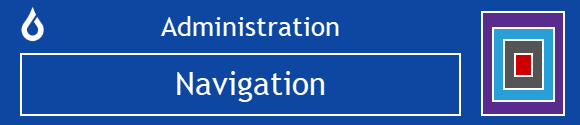
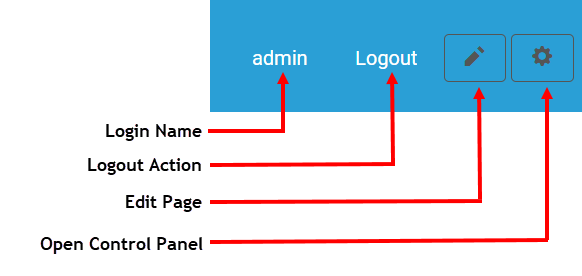
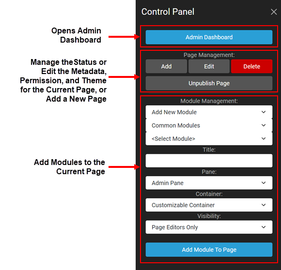

# Admin Navigation

### Top Navigation

Oqtane has two different theme possibilities in the default installation - the Oqtane theme or the Blazor theme. For either of these themes, the upper right part of the header of any given page displays the login name for the currently logged in user and a link for logging out of the site. This is displayed in the annotated screenshot below. 

 

If the logged-in user is an [Administrator](../site-administration/role-management.html), then two icons are also displayed on the right side of the header. Clicking on the left pencil icon allows the user to edit the page that is currently being displayed. Clicking on the right gear icon brings up the Control Panel as a slideout on the right, as discussed below. 

### Control Panel Navigation

[Administrators or content editors](../site-administration/role-management.html) can easily use the Control Panel for much of their daily work. 
The Control Panel offers three main areas for administration, as shown in the annotated screenshot below. 
* The top area contains a button at the top of the Control Panel that opens the [Admin Dashboard](./admin-dashboard.html). The Admin Dashboard allows multiple options for site or host administration. This top area is visible to [Administrators](../site-administration/role-management.html).
* The middle area is for [adding a new page](../pages/creating-page.html), editing the [metadata, permissions, or theme](../pages/page-settings.html) of the current page, or deleting or unpublishing the current page. This middle area is visible to [Administrators](../site-administration/role-management.html).
* The bottom area is for [adding modules](../modules/adding-modules.html) to the current page. This bottom area is visible to [Administrators or Content Editors](../site-administration/role-management.html).

 

 

It is worth noting that the default Control Panel is one of numerous extension points in Oqtane. Like modules, themes, and other extensions, the Control Panel can be replaced with a custom or third-party alternative.

