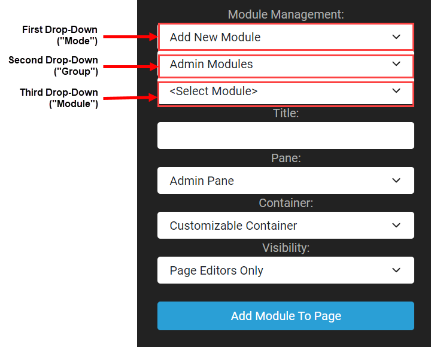

# Adding Modules to a Page

To add a module to a page, open the [control panel](../admin-navigation/control-panel.html). The bottom section of the control panel provides three module management drop-downs along with some other text fields. The choices for these drop downs and text fields will determine the module and its settings that are added to the current page when the "Add Module to Page" button is clicked. 

As shown in the annotated screenshot below, for the three drop downs starting from the top, we will call them the "Mode", "Group" and "Module" choices. The first drop-down "Mode" choice will determine the overall settings of the module that is added to the page. Options for first "Mode" drop-down are as follows. 

* **Add New Module** - Add a module with no preset values except what is set in the control panel
* **Add Existing Module** - Add a module from another page using its already preset values

 

### Add New Module Option

When the "Add New Module" is selected from the first "Mode" drop-down, then the options for the second "Group" drop down will be *Admin Modules*, *Common Modules*, and *Developer Modules*. Once a second "Group" drop-down choice is made, then only the [modules that belong to that group](./default-modules.html) are displayed in the third "Module" drop-down. 

Whatever module is then selected in the third "Module" drop-down will be the module that is added when the content manager clicks the "Add Module to Page" button at the bottom of the control panel. 

The text boxes after the drop-downs allow you to set the following fields for the module. 

* **Title** - Set the text that will be displayed directly above the module. If this is left blank then the module's name will be used as the title.
* **Pane** - Select which content pane you want the module to go inside of. Panes should be visible when the page is in [edit mode](../pages/editing-page.html).
* **Container** - Select if you would like to have a title displayed above the module or not have one.
* **Visibility** - Options are "Page Editors Only" or "Same As Page"

### Add Existing Module Option

When the "Add Existing Module" is selected from the first "Mode" drop-down, then the options for the second "Group" drop down will display all of the current pages in the site. Choosing any page in this second "Group" drop down will cause only the modules that are used in the selected page to be displayed in the third "Module" drop-down. 

Whatever module is then selected in the third "Module" drop-down will be the module that is added when the content manager clicks the "Add Module to Page" button at the bottom of the control panel. 

**The key difference here is that the values that were used for that module on the existing page will also be used for the module being inserted on the current page. In other words, inserting the module in this page is like using a reference to the same module on the other page.**

This option can increase efficiency and good practices for many situations. Say, for example, you have an HTML module that holds a banner image and you want that banner image to also exist on five specific pages in your site. Instead of adding a new module to all five of those pages and then inserting the same image, you can simply go into the Module Management section of the Control Panel and click "Add an Existing Module" and select the existing module on an existing page. A content manager can then make edits in one module and instantly have those edits reflected across every page on which the module is shared. 

The text boxes after the drop-downs allow you to set the following fields for the module. 

* **Title** - Set the text that will be displayed directly above the module. This text will override the title of the existing module. If this is left blank then the referenced module's title will be used.
* **Pane** - Select which content pane you want the module to go inside of. Panes should be visible when the page is in [edit mode](../pages/editing-page.html).
* **Container** - Select if you would like to have a title displayed above the module or not have one.
* **Visibility** - Options are "Page Editors Only" or "Same As Page"

