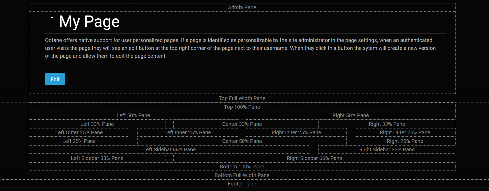

# Modules

### What is a Module?
A module is a reusable, plug-and-play piece of functionality. It's a way to extend the functionality of the framework with different capabilities. There can be multiple modules on a page, including multiple instances of the same module on a page. It's very common to have multiple [HTML modules](./htmledit-module.html) on a single page.

When you install Oqtane, the platform ships with a [set of default modules](./default-modules.html). You can also [extend an Oqtane installation](./add-ext-modules.html) with additional modules from the [catalog service](https://www.oqtane.net). You can also [create your own custom modules](./creating-modules.html) for your site or for use by other Oqtane sites. 

### Modules on Pages
Modules can be [placed onto pages](./adding-modules.html) from the control panel in locations called “panes”. These panes are defined by the theme's designer. These themes dictate the overall look and feel of your site and are often created by a front-end designer. Panes can span the full width of the page or be positioned in a column fashion. It may be helpful to think of panes as windows in the design of the site where you can drop in modules. You can move modules around the panes when in [edit mode](../pages/editing-page.html). An example of a page in edit mode with the panes displayed is shown below.

