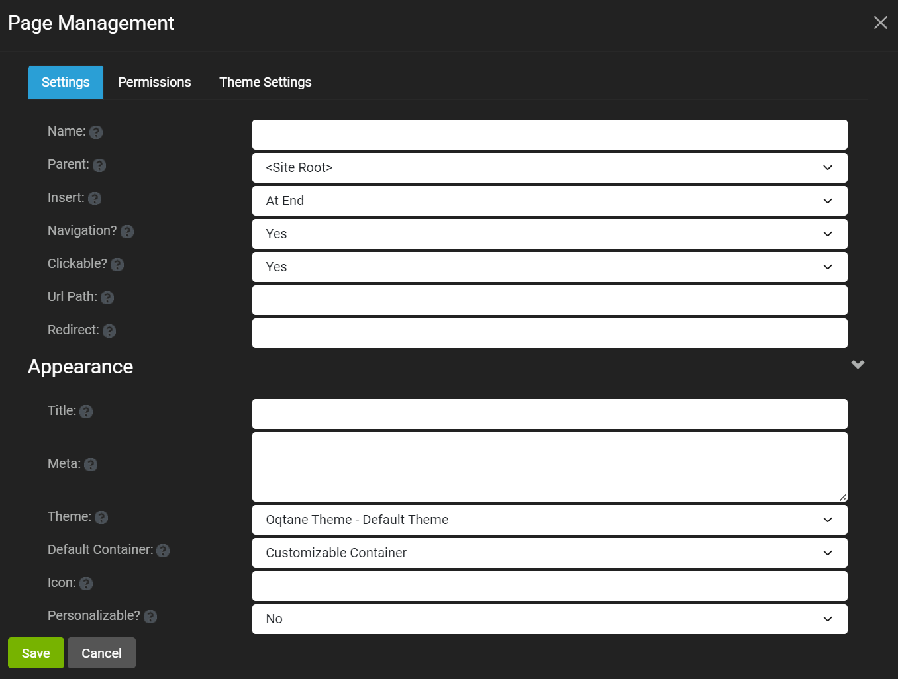
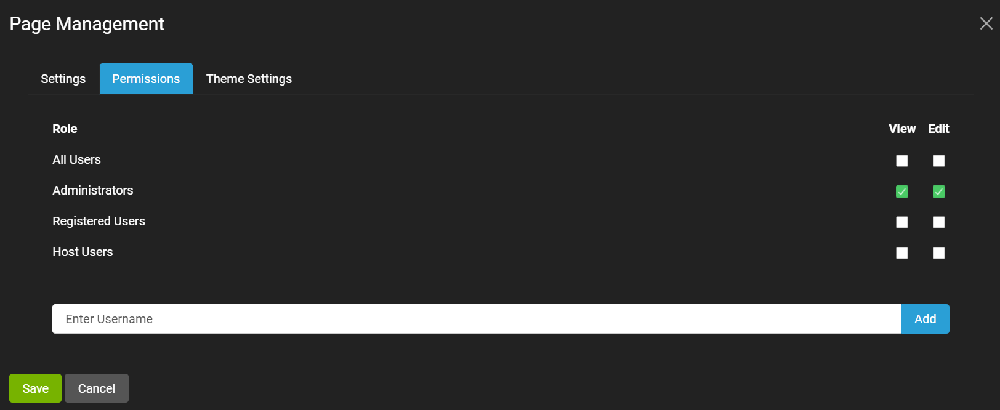
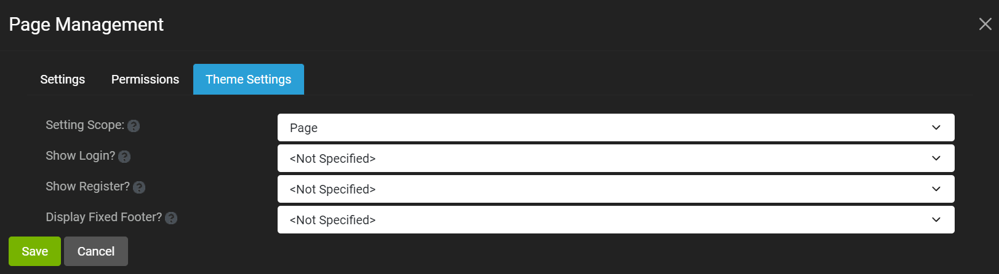

# Single Page Settings

You can configure the page settings for a given page when you create a new page or edit the page settings, for example from the Edit button in the [control panel](../admin-navigation/control-panel.html). 

The page settings include the page metadata, appearance, permissions, and theme. 

### Page Metadata and Appearance Settings

The metadata and appearance settings are the default tab displayed for the single page settings, as show in the screenshot below. 

The metadata settings for a given page are described below. 

* **Name** - 
* **Parent** - 
* **Insert** - 
* **Navigation?** - 
* **Clickable?** - 
* **Url Path** - 
* **Redirect** - 

The appearance settings for a given page are described below. 

* **Title** - 
* **Meta** - 
* **Theme** - 
* **Default Container** - 
* **Icon** - 
* **Personalizable?** - 

### Page Permissions

The page permission settings are the second tab displayed, as show in the screenshot below. 

As can be seen in the screenshot, View and Edit permissions can be set for this page using a [role](../site-administration/role-management.html) or for a given user. 

### Page Theme Settings

The page theme settings are the third tab displayed, as show in the screenshot below. 

The theme settings for a given page are described below. 

* **Setting Scope** - 
* **Show Login?** - 
* **Show Register?** - 
* **Display Fixed Footer?** - 

