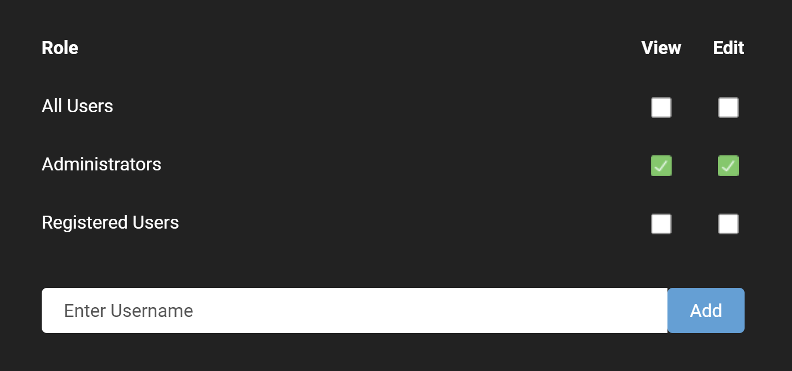

# Role Management

### Security Roles in Oqtane
In the default installation of Oqtane, there are three values for roles - *Host Users*, *Administrators*, and *Registered Users*. It is also possible to define custom security roles using role names defined by an Administrator. How these default and custom roles relate to user permission levels is explained below. 

### Users According to Permission Levels
In order to maintain consistency and to minimize any confusion with the value used for the roles (*Host Users*, *Administrators*, and *Registered Users*), we refer in this documentation to users according to their overall permission level. The permission levels are described below. 

* **Host Administrator** - A site user who has the *Host Users* role. The Host Administrator has the most powerful set of permissions and is meant for manging the instance of Oqtane as a whole. The Host Administrator can edit all Oqtane host settings as well as any of the site settings within the Oqtane instance and any of the pages within the Oqtane instance. The actions that a Host Administrator takes are called Host Administration. 
* **Site Administrator** - A site user who has the *Administrators* role. The Site Administrator can edit all of the site settings for the site where it is given the *Administrators* role. The Site Administrator can also edit any of the pages within the site where it has the *Administrators* role. The actions that a Site Administrator takes are called Site Administration.
* **Administrators** - Refers to a user who has either the Host Administrator or Site Administrator level of permissions. When setting permissions for page viewing and editing, both Host Administrators and Site Administrators are grouped together as Administrators. In this documentation, when referring to Administrators, we are referring to those with either the Host Administration or the Site Administration set of permissions. 
* **Content Editor** - Refers to a site user who has permissions to edit the content of a given page or extend the page with a module. Note that this permission for a page can be assigned to either a role or to an individual user. 

### Using Roles
The default and custom security roles can be used in different ways according to the needs of your website. For pages, roles can determine whether a page or groups of pages can be viewed or edited. For modules, a role can determine whether the module can be seen or not when adding a module to a page or whether content of a given module can be edited. In general, security roles can be used for content management, content editing, and hiding sections of your site.

Security roles work in a similar way to most permissions-based systems, such as Windows. You can create a security role if it doesn't already exist. You can assign users to one or more of the default or custom security roles. You can apply a role to the management or editing of pages or modules. 

The screenshot below shows how permissions are set when creating or editing pages and modules by selecting which roles can edit or view them.

At the top of the page is the add role button that allows for the addition of a new group you want to make, with a name, description, and saying if it should be automatically assigned to users. You can edit, delete, and manage users in each role except for the default administrator and registered users roles which you cannot edit or delete, you can only manage their users.
When adding a user into a role, there are fields for effective date and expiry date, which determines when a user will be added to a roles and how long they will be inside of a role.

 
