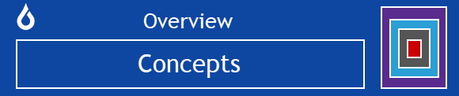
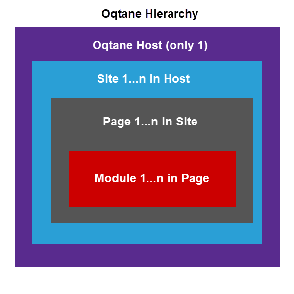

# Oqtane Concepts

### Oqtane Conceptual Hierarchy

From a conceptual viewpoint, there are multiple hierarchical levels for an Oqtane installation as summarized below. 

* **Host** - The highest level. There is only one host per Oqtane instance. To change settings for a host, a user needs to have the Host Users role. 
* **Site** - The second highest level. There can be one or more sites within a host because Oqtane has a multitenant architecture. The Host Users and Administrators roles have privileges to change settings for a site. 
* **Page** - The third highest level. There can be one or more pages within a site. The Host Users and Administrators roles have privileges to change settings and content for a page. 
* **Module** - The fourth highest level. There can be one or more modules within a page. The Host Users and Administrators roles have privileges to change settings for a module and to create a new module. 

This hierarchy is illustrated below. Note that this diagram is also the inspiration for the graphic seen on the right side of heading bars throughout this documentation. The graphic can act as a reminder for the conceptual hierarchy within Oqtane. 

